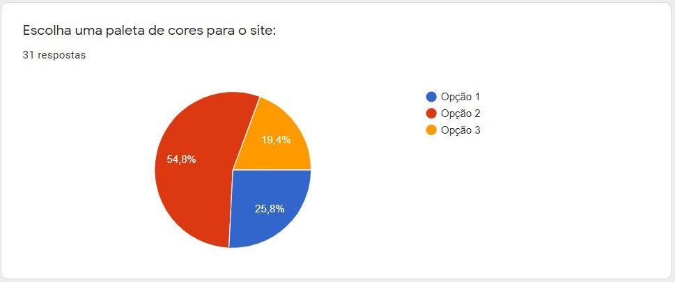

# FoodLovers

## Índice

- [1. Sobre](#Sobre)
- [2. Definição de Produto](#Definição-de-produto)
- [3. Layout](#Layout)
- [4. Histórias de Usuários](#Histórias-de-Usuários)
- [6. Testes de Usabilidade](#Testes-de-Usabilidade)
- [7. Produto Final](#Produto-Final)
- [8. Tecnologias](#Tecnologias)
- [9. Autoras](#Autoras)

---

# Sobre

FoodLovers é uma rede social pensada para os amantes de culinária, desde amadores até profissionais, que queiram compartilhar e aprender novas receitas. A rede permite qualquer pessoa aprimorar seus talentos em culinária e dividir seus conhecimentos postando suas receitas (com fotos), buscar novos pratos pelo nome ou ingrediente e dar likes nos seus posts favoritos. Visando criar um espaço de compartilhamento mais direto e interativo.

## Layout

- Protótipos de baixa fidelidade

- Protótipos de alta fidelidade

- Responsividade

## Histórias de Usuários

Ao fazer pesquisa com potenciais usuários, construímos nossas histórias de usuários.

A paleta de co

## Testes de Usabilidade

De acordo com o resultado dos testes de usabilidade, alteramos as cores iniciais para um layout mais "clean", possibilitando ao usuário uma melhor experiência de navegação. Também implementamos hovers nos botões para deixar o site mais intuitivo.

## Produto final 

## Tecnologias

- Javascript
- CSS3
- HTML5
- Json
- Jest
- Firebase

## Autoras
- [@Tauana-Pacheco](https://github.com/Tauana-Pacheco) 

- [@Thais-F](https://github.com/Thais-F)

- [@yukaum](https://github.com/yukaum) 

